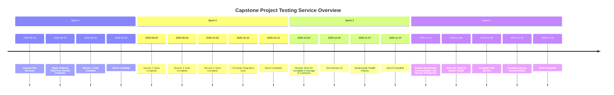
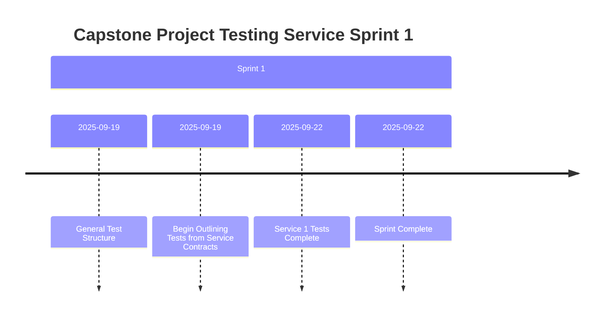
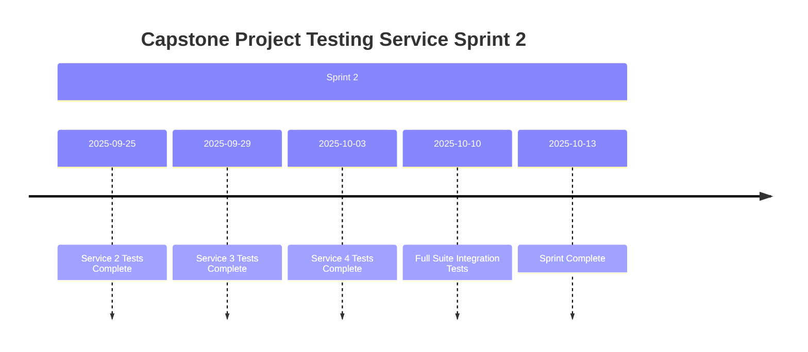
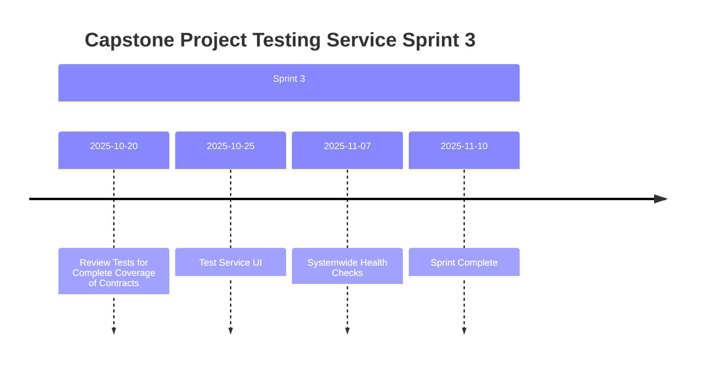
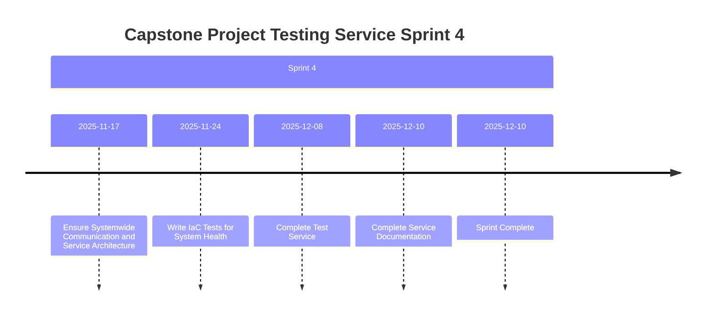

# Timeline for Testing Service

## Overview

```mermaid
timeline
    title Capstone Project Testing Service Overview
    dateFormat YYYY-MM-DD
    section Sprint 1
        2025-09-19: General Test Structure
        2025-09-19: Begin Outlining Tests from Service Contracts
        2025-09-22: Service 1 Tests Complete
        2025-09-22: Sprint Complete  
    section Sprint 2
        2025-09-25: Service 2 Tests Complete
        2025-09-29: Service 3 Tests Complete
        2025-10-03: Service 4 Tests Complete
        2025-10-10: Full Suite Integration Tests
        2025-10-13: Sprint Complete
    section Sprint 3
        2025-10-20: Review Tests for Complete Coverage of Contracts
        2025-10-25: Test Service UI
        2025-11-07: Systemwide Health Checks
        2025-11-10: Sprint Complete
    section Sprint 4
        2025-11-17: Ensure Systemwide Communication and Service Architecture
        2025-11-24: Write IaC Tests for System Health
        2025-12-08: Complete Test Service
        2025-12-10: Complete Service Documentation
        2025-12-10: Sprint Complete
```

## Sprint 1 (Ends Sept 26th):

```mermaid
timeline
    title Capstone Project Testing Service Sprint 1
    dateFormat YYYY-MM-DD
    section Sprint 1
        2025-09-19: General Test Structure
        2025-09-19: Begin Outlining Tests from Service Contracts
        2025-09-22: Service 1 Tests Complete
        2025-09-22: Sprint Complete  
```

## Sprint 2 (Ends October 10th):

```mermaid
timeline
    title Capstone Project Testing Service Sprint 2
    dateFormat YYYY-MM-DD
    section Sprint 2
        2025-09-25: Service 2 Tests Complete
        2025-09-29: Service 3 Tests Complete
        2025-10-03: Service 4 Tests Complete
        2025-10-10: Full Suite Integration Tests
        2025-10-13: Sprint Complete
```

## Sprint 3 (Ends Nov 3):

```mermaid
timeline
    title Capstone Project Testing Service Sprint 3
    dateFormat YYYY-MM-DD
    section Sprint 3
        2025-10-20: Review Tests for Complete Coverage of Contracts
        2025-10-25: Test Service UI
        2025-11-07: Systemwide Health Checks
        2025-11-10: Sprint Complete
```

## Sprint 4 (Ends Nov 17th):

```mermaid
timeline
    title Capstone Project Testing Service Sprint 4
    dateFormat YYYY-MM-DD
    section Sprint 4
        2025-11-17: Ensure Systemwide Communication and Service Architecture
        2025-11-24: Write IaC Tests for System Health
        2025-12-08: Complete Test Service
        2025-12-10: Complete Service Documentation
        2025-12-10: Sprint Complete
```